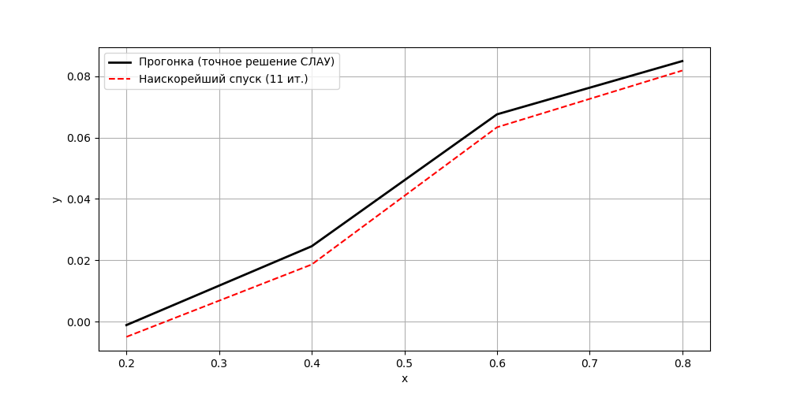
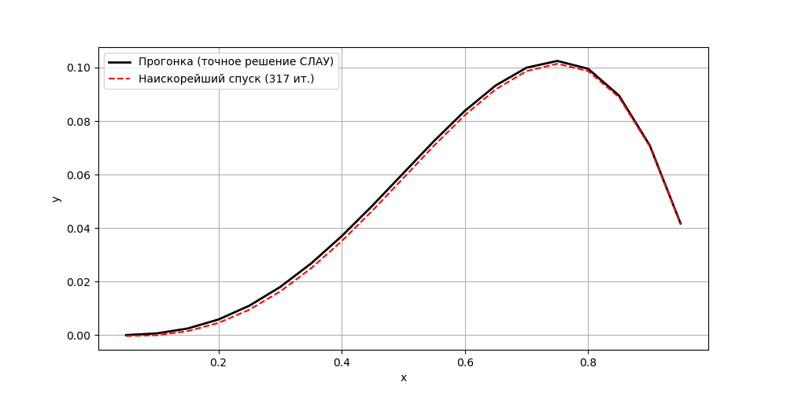
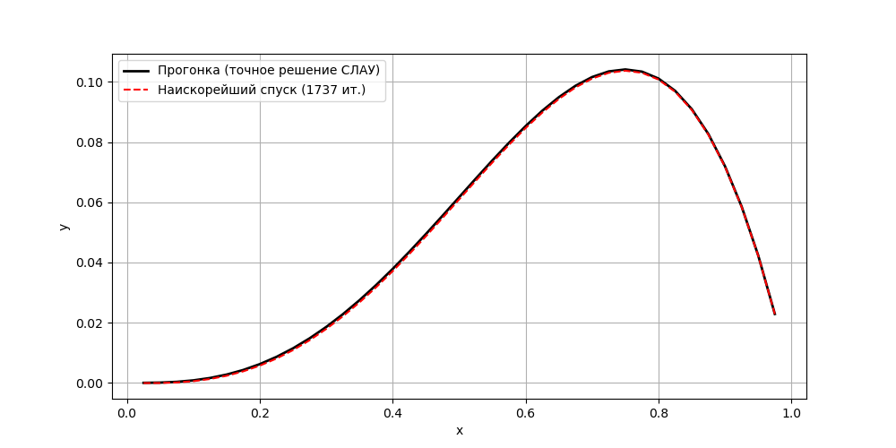
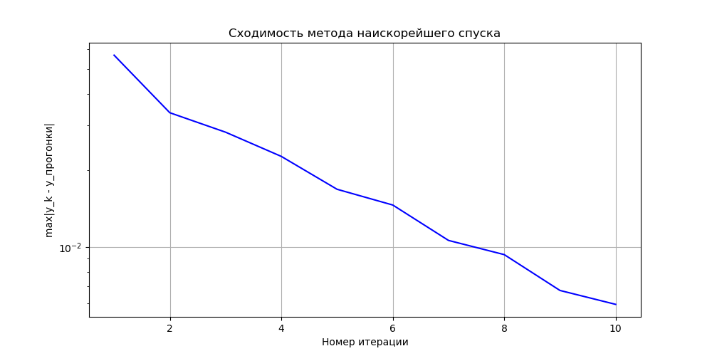
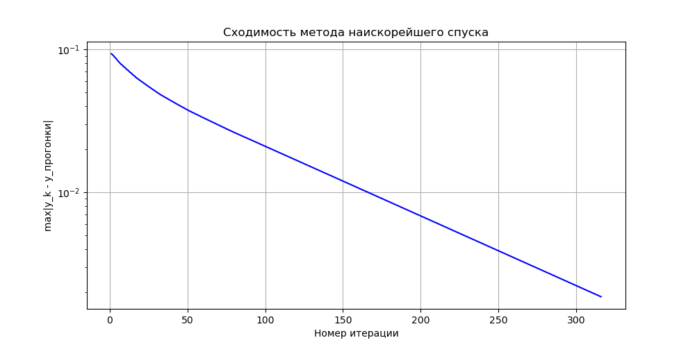
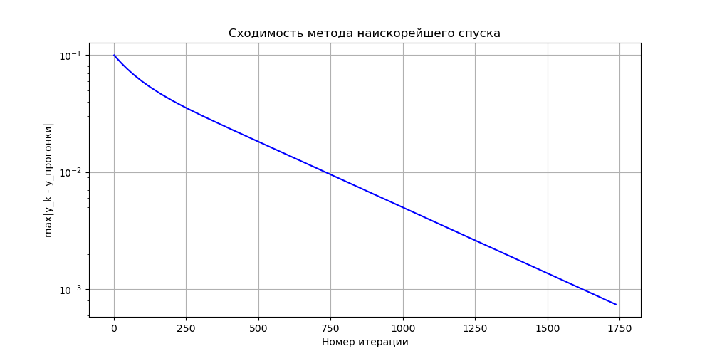

# Отчет по лабораторной работе: Численные методы решения систем линейных уравнений

Мусин Азат, 2026

---
## Постановка задачи и исходные данные
Требуется решить систему линейных алгебраических уравнений (СЛАУ) вида:

$$ 
\begin{cases}
(a_1 + a_2 + h^2 g)y_1 - a_2 y_2 = f_1 h^2, \\
\dots \\
-a_i y_{i-1} + (a_i + a_{i+1} + h^2 g_i)y_i - a_{i+1} y_{i+1} = f_ih^2, \\
\dots \\
(a_{n-1} + a_n + h^2 g_{n-1})y_{n-1} - a_{n-1} y_{n-2} = f_{n-1} h^2. \\
\end{cases}
$$
При следующих условиях:
$$
\begin{aligned}
&n = 40 \\ 
&\epsilon = h^3 = \left(\frac{1}{40}\right)^3 = 0.000015625 \\
&u(x) = x^\alpha(1-x)^\beta \\
&p(x) = 1 + x^\gamma \\
&g(x) = x + 1 \\
&\begin{cases}
    \alpha = 3\\
    \beta = 1\\
    \gamma = 2 
\end{cases}
\end{aligned}
$$

## Конкретизация задачи: дискретизация и коэффициенты

### 1. Точное решение и правая часть
Краевая задача, для которой строилась разностная схема, имеет вид
$$
-\big(p(x)u'(x)\big)' + q(x)u(x) = f(x),\qquad x\in(0,1),\\
u(0)=0,\quad u(1)=0.
$$

При заданных параметрах $\alpha = 3,\quad \beta = 1,\quad \gamma = 2$ и функциях
$$
p(x) = 1 + x^\gamma = 1 + x^2,\qquad
q(x) = g(x) = x + 1\\
u(x) = x^\alpha(1-x)^\beta = x^3(1-x).
$$
Где $u(x)$ точное решение по условию.

Функция правой части $f(x)$ получена подстановкой $u(x)$ в левую часть дифференциального уравнения:
$$
f(x) = -\big(p(x)u'(x)\big)' + q(x)u(x)
      = -x^5 + 20x^4 - 11x^3 + 12x^2 - 6x.
$$

### 2. Разностная схема
Отрезок $[0,1]$ разбиваем на $n$ равных частей с шагом $h = 1/n$. Узлы сетки:
$$ x_i = i\,h,\qquad i = 0,1,\dots,n.
$$
Приближённые значения $y_i \approx u(x_i)$ ищем во внутренних узлах $i=1,\dots,n-1$ ($n-1$ уравнение).

Аппроксимируем дифференциальное уравнение, заменяя производные конечными разностями. Используем шаблон, в котором значения $p(x)$ берутся в узлах сетки (простейшая аппроксимация потока):
$$
-\frac{1}{h}\Big(p(x_{i+1/2})\frac{y_{i+1}-y_i}{h} - p(x_{i-1/2})\frac{y_i-y_{i-1}}{h}\Big)
\approx
-\frac{p_i}{h^2}y_{i-1} + \frac{p_i+p_{i+1}}{h^2}y_i - \frac{p_{i+1}}{h^2}y_{i+1},
$$
где принято $p_i = p(x_i)$. Добавляя слагаемое $q_i y_i$ и умножая уравнение на $h^2$, получаем:

$$
-p_i y_{i-1} + \big(p_i + p_{i+1} + h^2 q_i\big) y_i - p_{i+1} y_{i+1} = f_i h^2,
\qquad i=1,\dots,n-1,
$$
с учётом граничных условий $y_0 = 0,\; y_n = 0$. Здесь
$$
p_i = p(x_i) = 1 + (i h)^2,\qquad
q_i = q(x_i) = x_i + 1,\qquad
f_i = f(x_i).
$$

Таким образом, система имеет трёхдиагональный вид, и для неё справедливы обозначения, введённые в постановке задачи:
$$
a_i = p_i \quad (i=1,\dots,n).
$$

### 3. Коэффициенты системы для метода прогонки

Запишем $i$-е уравнение в стандартной для прогонки форме
$$
A_i y_{i-1} + B_i y_i + C_i y_{i+1} = D_i,
\qquad i=1,\dots,N.
$$

Подставляя явные выражения, получаем:

$$
\begin{aligned}
A_i &= -a_i = -p_i = -(1 + (i h)^2),\\
B_i &= a_i + a_{i+1} + h^2 q_i = p_i + p_{i+1} + h^2 (x_i+1),\\
C_i &= -a_{i+1} = -p_{i+1} = -(1 + ((i+1)h)^2),\\
D_i &= f_i h^2 = \big(-x_i^5 + 20x_i^4 - 11x_i^3 + 12x_i^2 - 6x_i\big)\,h^2,\\
x_i &= i h,\quad h = 1/n.
\end{aligned}
$$

Для первой строки ($i=1$) слагаемое $A_1 y_0 = A_1\cdot 0 = 0$, поэтому в матрице оно опускается; аналогично для последней строки $i=N$ отсутствует $C_N$.

### 4. Проверка устойчивости прогонки
Достаточное условие устойчивости (строгого диагонального преобладания) имеет вид
$$
|B_i| \ge |A_i| + |C_i|,\quad i=1,\dots,N,
$$
причём хотя бы для одного уравнения неравенство должно быть строгим. Для наших коэффициентов:
$$
\begin{aligned}
|A_i| + |C_i| &= p_i + p_{i+1},\\
        |B_i| &= p_i + p_{i+1} + h^2 (x_i+1).
\end{aligned}
$$

Так как $h>0$ и $x_i+1 \ge 1 > 0$ на всём интервале $[0,1]$, то
$$
|B_i| = |A_i| + |C_i| + h^2 (x_i+1) > |A_i| + |C_i|.
$$
Следовательно, условие строгого диагонального преобладания выполнено для **каждого** уравнения. Метод прогонки устойчив, и вычисления ведутся без накопления вычислительной погрешности.

### 5. Свойства матрицы для метода наискорейшего спуска

Матрица системы $A$ трёхдиагональная с элементами:

- главная диагональ: $B_i = p_i + p_{i+1} + h^2 q_i$;
- нижняя диагональ: $A_i = -p_i$;
- верхняя диагональ: $C_i = -p_{i+1}$.

Симметричность видна сразу, так как $A_{i,i-1} = A_{i-1,i} = -p_i$.  
Положительная определённость следует из того, что матрица получается из симметричной положительно определённой разностной аппроксимации оператора $-\nabla(p\nabla) + q$ с $p>0,\; q>0$ и однородными граничными условиями Дирихле. На практике это подтверждается устойчивой работой метода прогонки и сходимостью итераций.

---
## Описание метода решения и расчетные формулы
### Метод наискорейшего спуска
Метод наискорейшего спуска это итерационный численный метод решения систем линейных алгебраических уравнений вида $Ay=b$ с симметричной положительно определённой матрицей $A$.

В отличие от методов Якоби, Зейделя и релаксации, в которых компоненты решения обновляются по отдельности, метод наискорейшего спуска одновременно изменяет все компоненты вектора $y$, двигаясь вдоль направления невязки. На каждой итерации $k$ новое приближение вычисляется по формуле:
$$ y^{k+1} = y^k + \alpha_k ​r^k $$
где:
- $r^k = b - Ay^k$ это вектор невязки на итерации $k$, определяющий направление спуска (направление наискорейшего убывания);

- $\alpha_k$​ - оптимальный шаг вдоль направления невязки, вычисляемый из условия минимума функции $\Phi(y) = \frac{1}{2} y^T Ay - b^Ty$ вдоль луча $y^k + \alpha r^k$:
  $$ \alpha_k = \frac{(r^k)^T r^k}{(r^k)^T A r^k} $$
- $A r^k$ - результат умножения матрицы &A& на вектор невязки, необходимый для расчёта шага $\alpha_k$

#### Условия сходимости:
Матрица $A$ должна быть симметричной и положительно определённой (СПО). Тогда метод сходится при любом начальном приближении.

В нашем случае матрица $A$ трёхдиагональная, порождена разностной аппроксимацией с $p(x)=1+x^\gamma>0$ и $q(x)=x+1 \ge 1>0$, что гарантирует её симметрию и положительную определённость, условия сходимости выполнены.

#### Критерий остановки
Итерации продолжаются до выполнения условия:
$$ \max_{1\le i\le n-1}{\left|r_i^k\right|} \le \epsilon,
$$
### Метод прогонки
Для проверки будем сравнивать решение методом релаксации с решением методом прогонки
Метод прогонки - это эффективный численный метод решения систем линейных алгебраических уравнений с трёхдиагональной матрицей.
Рассматривается система уравнений вида:
$$ a_i x_{i-1} + b_i x_i + c_i x_{i+1} = d_i
$$
Где:
- $i = 1, \dots, n$ индексы уравнений;
- $b_i$ коэффициенты на главной диагонали;
- $a_i$ коэффициенты под главной диагональю ();
- $c_i$ коэффициенты над главной диагональю ();
- $d_i$ правая часть.
Метод состоит из двух проходов: прямого и обратного. Идея заключается в том, чтобы на прямом ходу выразить $x_i$ через $x_{i+1}$ с помощью вспомогательных коэффициентов:
$$ x_i = \alpha_{i+1} x_{i+1} + \beta_{i+1}
$$
#### Прямой ход
Здесь мы идем слева направо (от $i=1$ до $n-1$):
Для первого узла:
$$ \alpha_{2} = \frac{B_1}{C_1},
   \beta_{2} = \frac{F_1}{C_1}
$$

Рекуррентные формулы:
$$ \alpha_{i+1} = \frac{B_i}{C_i - A_i \alpha_{i}},
   \beta_{i+1} = \frac{F_i + A_i \beta_i}{C_i - A_i \alpha_i}
$$
####  Обратный ход
После обработки всех строк до $n$, последнее уравнение примет вид $x_n = \beta_{n+1}$ (так как $c_n = 0$)

Затем последовательно вычисляем остальные значения:
$$ x_i = \alpha_{i+1} x_{i+1} + \beta_{i+1}, \\ i = n-1, n-2, \dots, 1
$$

#### Устойчивость прогонки
Условие прогонки:
$$ |B_i| > |A_i| + |C_i| $$
- $B_i$ - Центральная диагональ: $A_{i,i} = a_i + a_{i+1} + h^2g_i$
- $A_i$ - Нижняя диагональ: $A_{i,i-1} = -a_i$
- $C_i$ - Верхняя диагональ: $A_{i,i+1} = -a_{i+1}$

После подстановки значений:
$$ |a_i + a_{i+1} + h^2 g_i| \ge |-a_{i}| + |-a_{i+1}| $$

Так как $p(x) > 0$ и $g(x)=x+1>0$ на отрезке $[0, 1]$, то:
$$ a_{i} + a_{i+1} + h^2 g_i > a_i + a_{i+1} \\
h^2 g_i > 0
$$

Поскольку шаг $h>0$ и функция $g(x) \ge 1$ на рассматриваемом интервале, условие строго диагонального преобладания выполняется.

---
## Практическая часть
### Таблицы и графики значений $y_i$ и $y_i^k$.
#### Случай $n = 5$
Метод наискорейшего спуска: сошёлся за 11 итераций.
Максимальная невязка: 5.15e-03

| i | x | y_прогонка | y_спуск |
|---|---|---|---|
| 1 | 0.2000 | -0.0011323584 | -0.0049752162 |
| 2 | 0.4000 | 0.0245752226 | 0.0186217829 |
| 3 | 0.6000 | 0.0675800803 | 0.0633685174 |
| 4 | 0.8000 | 0.0849472338 | 0.0818626988 |




#### Случай $n = 20$
Метод наискорейшего спуска: сошёлся за 317 итераций.
Максимальная невязка: 1.24e-04

| i | x | y_прогонка | y_спуск |
|---|---|---|---|
| 1 | 0.0500 | -0.0000384704 | -0.0003899847 |
| 2 | 0.1000 | 0.0005946565 | -0.0000938008 |
| 3 | 0.1500 | 0.0024172663 | 0.0014190408 |
| 4 | 0.2000 | 0.0057953990 | 0.0045253659 |
| 5 | 0.2500 | 0.0109449936 | 0.0094495434 |
| 6 | 0.3000 | 0.0179334924 | 0.0162647837 |
| 7 | 0.3500 | 0.0266812185 | 0.0248944337 |
| 8 | 0.4000 | 0.0369624703 | 0.0351132339 |
| 9 | 0.4500 | 0.0484063130 | 0.0465483045 |
| 10 | 0.5000 | 0.0604970736 | 0.0586803938 |
| 11 | 0.5500 | 0.0725745705 | 0.0708434794 |
| 12 | 0.6000 | 0.0838341199 | 0.0822284380 |
| 13 | 0.6500 | 0.0933263686 | 0.0918746434 |
| 14 | 0.7000 | 0.0999570013 | 0.0986916404 |
| 15 | 0.7500 | 0.1024863677 | 0.1014101873 |
| 16 | 0.8000 | 0.0995290656 | 0.0986818062 |
| 17 | 0.8500 | 0.0895535099 | 0.0888976791 |
| 18 | 0.9000 | 0.0708815091 | 0.0704747503 |
| 19 | 0.9500 | 0.0416878643 | 0.0414694284 |



#### Случай $n = 40$
Метод наискорейшего спуска: сошёлся за 1737 итераций.
Максимальная невязка: 1.56e-05

| i | x | y_прогонка | y_спуск |
|---|---|---|---|
| 1 | 0.0250 | -0.0000080106 | -0.0000779923 |
| 2 | 0.0500 | 0.0000729314 | -0.0000663039 |
| 3 | 0.0750 | 0.0003222527 | 0.0001151617 |
| 4 | 0.1000 | 0.0008098854 | 0.0005369808 |
| 5 | 0.1250 | 0.0015962948 | 0.0012602279 |
| 6 | 0.1500 | 0.0027325071 | 0.0023364946 |
| 7 | 0.1750 | 0.0042601369 | 0.0038079094 |
| 8 | 0.2000 | 0.0062114149 | 0.0057071595 |
| 9 | 0.2250 | 0.0086092141 | 0.0080575115 |
| 10 | 0.2500 | 0.0114670743 | 0.0108728333 |
| 11 | 0.2750 | 0.0147892258 | 0.0141576154 |
| 12 | 0.3000 | 0.0185706103 | 0.0179069914 |
| 13 | 0.3250 | 0.0227969000 | 0.0221067581 |
| 14 | 0.3500 | 0.0274445140 | 0.0267333939 |
| 15 | 0.3750 | 0.0324806329 | 0.0317540764 |
| 16 | 0.4000 | 0.0378632105 | 0.0371266983 |
| 17 | 0.4250 | 0.0435409832 | 0.0427998813 |
| 18 | 0.4500 | 0.0494534771 | 0.0487129891 |
| 19 | 0.4750 | 0.0555310133 | 0.0547961373 |
| 20 | 0.5000 | 0.0616947110 | 0.0609702031 |
| 21 | 0.5250 | 0.0678564882 | 0.0671468320 |
| 22 | 0.5500 | 0.0739190621 | 0.0732284434 |
| 23 | 0.5750 | 0.0797759465 | 0.0791082340 |
| 24 | 0.6000 | 0.0853114493 | 0.0846701816 |
| 25 | 0.6250 | 0.0904006684 | 0.0897890418 |
| 26 | 0.6500 | 0.0949094866 | 0.0943303603 |
| 27 | 0.6750 | 0.0986945660 | 0.0981504361 |
| 28 | 0.7000 | 0.1016033420 | 0.1010964119 |
| 29 | 0.7250 | 0.1034740170 | 0.1030060409 |
| 30 | 0.7500 | 0.1041355535 | 0.1037082250 |
| 31 | 0.7750 | 0.1034076672 | 0.1030217987 |
| 32 | 0.8000 | 0.1011008202 | 0.1007580803 |
| 33 | 0.8250 | 0.0970162144 | 0.0967157984 |
| 34 | 0.8500 | 0.0909457846 | 0.0906904851 |
| 35 | 0.8750 | 0.0826721918 | 0.0824582646 |
| 36 | 0.9000 | 0.0719688172 | 0.0718016297 |
| 37 | 0.9250 | 0.0585997563 | 0.0584719784 |
| 38 | 0.9500 | 0.0423198126 | 0.0422385722 |
| 39 | 0.9750 | 0.0228744925 | 0.0228322701 |


---

### Сходимость наискорейшего спуска




Листинг программы
```python
import numpy as np
import matplotlib.pyplot as plt
import os

alpha, beta, gamma = 3, 1, 2

def p(x): return 1 + x**gamma
def q(x): return x + 1
def u_exact(x): return x**alpha * (1-x)**beta
def f(x):
    return -x**5 + 20*x**4 - 11*x**3 + 12*x**2 - 6*x

def write_to_file(data, filename):
    dir_name = os.path.dirname(filename)
    if dir_name:
        os.makedirs(dir_name, exist_ok=True)
    with open(filename, 'a', encoding='utf-8') as f:
        f.write(data+"\n")

for n in [5, 20, 40]:
    filename = "data/solve-n-" + str(n)

    h = 1.0 / n
    eps = h**3
    N = n - 1 # число внутренних узлов (уравнений)

    x = np.linspace(0, 1, n+1)
    xi = x[1:-1] # внутренние узлы

    p_vals = p(x)
    q_vals = q(xi)
    f_vals = f(xi)
    # Диагонали трёхдиагональной матрицы
    main_diag = p_vals[1:-1] + p_vals[2:] + h**2 * q_vals    # d_i
    lower_diag = -p_vals[1:-1]                               # l_i (i=2..N)
    upper_diag = -p_vals[2:]                                 # u_i (i=1..N-1)
    rhs = f_vals * h**2                                      # b_i

    write_to_file("Проверка устойчивости прогонки", filename)
    # Условие диагонального преобладания (строгое)
    # Для первой и последней строки проверяем вручную
    strict_first = abs(main_diag[0]) > abs(upper_diag[0])
    strict_last  = abs(main_diag[-1]) > abs(lower_diag[-1])
    strict_mid   = all(abs(main_diag[i]) > abs(lower_diag[i]) + abs(upper_diag[i]) for i in range(1, N-1))
    write_to_file(f"Строгое диагональное преобладание в 1-й строке: {strict_first}", filename)
    write_to_file(f"Строгое диагональное преобладание в последней строке: {strict_last}", filename)
    write_to_file(f"Строгое диагональное преобладание в средних строках: {strict_mid}", filename)
    if strict_first and strict_last and strict_mid:
        write_to_file("Прогонка устойчива (достаточное условие выполнено).", filename)
    else:
        write_to_file("Внимание: условие строгого диагонального \
           преобладания нарушено, но прогонка может быть ещё устойчива.", filename)


    # Метод прогонки (точное решение)
    def classic_solve(d, l, u, b):
        n_eq = len(d)
        P = np.zeros(n_eq)
        Q = np.zeros(n_eq)
        P[0] = u[0] / d[0]
        Q[0] = b[0] / d[0]
        for i in range(1, n_eq-1):
            denom = d[i] - l[i] * P[i-1]
            P[i] = u[i] / denom
            Q[i] = (b[i] - l[i] * Q[i-1]) / denom
        i = n_eq - 1
        denom = d[i] - l[i] * P[i-1]
        Q[i] = (b[i] - l[i] * Q[i-1]) / denom
        y = np.zeros(n_eq)
        y[-1] = Q[-1]
        for i in range(n_eq-2, -1, -1):
            y[i] = Q[i] - P[i] * y[i+1]
        return y

    y_thomas = classic_solve(main_diag, lower_diag, upper_diag, rhs)

    # Метод наискорейшего спуска
    def residual(y):
        """Вычисляет вектор невязки r = b - A y"""
        r = np.empty(N)
        r[0] = rhs[0] - (main_diag[0]*y[0] + upper_diag[0]*y[1])
        for i in range(1, N-1):
            r[i] = rhs[i] - (lower_diag[i]*y[i-1] + main_diag[i]*y[i] + upper_diag[i]*y[i+1])
        r[-1] = rhs[-1] - (lower_diag[-1]*y[-2] + main_diag[-1]*y[-1])
        return r

    def A_mult(v):
        """Умножение матрицы A на вектор v"""
        Av = np.empty(N)
        Av[0] = main_diag[0]*v[0] + upper_diag[0]*v[1]
        for i in range(1, N-1):
            Av[i] = lower_diag[i]*v[i-1] + main_diag[i]*v[i] + upper_diag[i]*v[i+1]
        Av[-1] = lower_diag[-1]*v[-2] + main_diag[-1]*v[-1]
        return Av

    def max_error(y_num):
        return np.max(np.abs(y_num - y_thomas))

    y0 = np.zeros(N)
    y_sd = y0.copy()
    errors = []
    max_iter = 50000
    for it in range(max_iter):
        r = residual(y_sd)
        if np.max(np.abs(r)) <= eps:
            break
        Ar = A_mult(r)
        alpha = np.dot(r, r) / np.dot(r, Ar)
        y_sd = y_sd + alpha * r
        errors.append(max_error(y_sd))

    it_sd = it + 1
    write_to_file(f"\nМетод наискорейшего спуска: сошёлся за {it_sd} итераций.", filename)
    write_to_file(f"Максимальная невязка: {np.max(np.abs(residual(y_sd))):.2e}", filename)


    write_to_file("\nТаблица значений y_i :", filename)
    write_to_file("| i | x | y_прогонка | y_спуск |", filename)
    write_to_file("|---|---|---|---|", filename)
    step = 1
    for idx in range(0, N, step):
        write_to_file(f"| {idx+1} | {xi[idx]:.4f} | {y_thomas[idx]:.10f} | {y_sd[idx]:.10f} |", filename)


    # Решения
    plt.figure(figsize=(10, 5))
    plt.plot(xi, y_thomas, 'k-', linewidth=2, label='Прогонка (точное решение СЛАУ)')
    plt.plot(xi, y_sd, 'r--', label=f'Наискорейший спуск ({it_sd} ит.)')
    plt.xlabel('x')
    plt.ylabel('y')
    plt.legend()
    plt.grid(True)
    plt.savefig(filename + "-solve.png")

    # Убывание погрешности max|y_k - y_thomas|
    plt.figure(figsize=(10, 5))
    plt.semilogy(range(1, len(errors)+1), errors, 'b-')
    plt.xlabel('Номер итерации')
    plt.ylabel('max|y_k - y_прогонки|')
    plt.title('Сходимость метода наискорейшего спуска')
    plt.grid(True)
    plt.savefig(filename + "-acc.png")
```