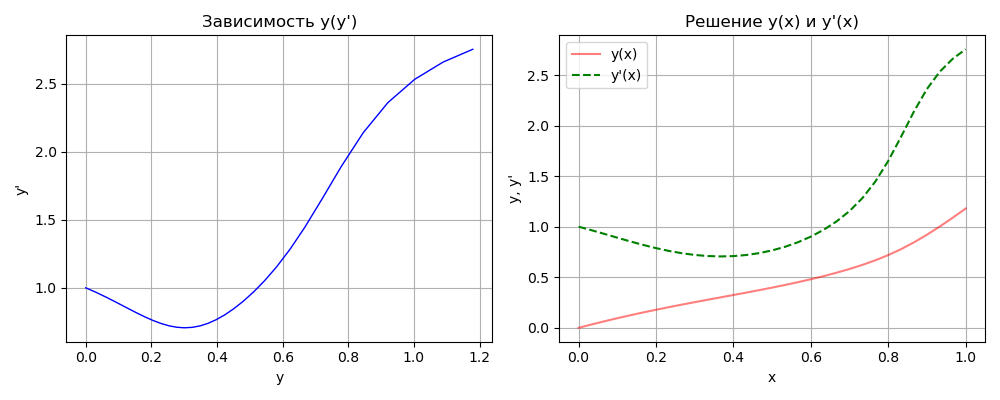
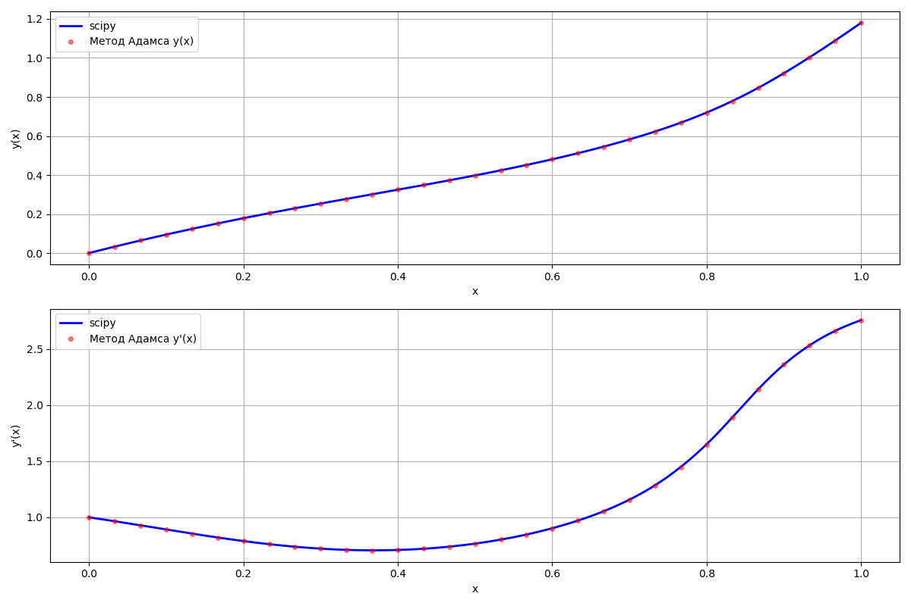
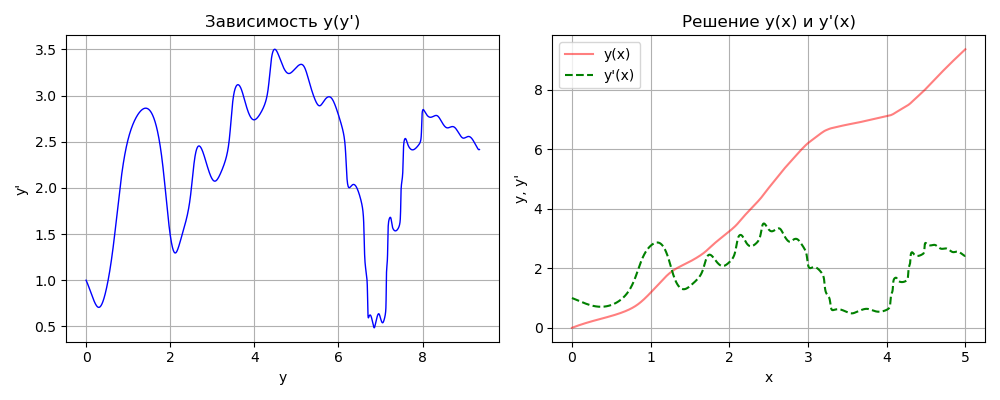
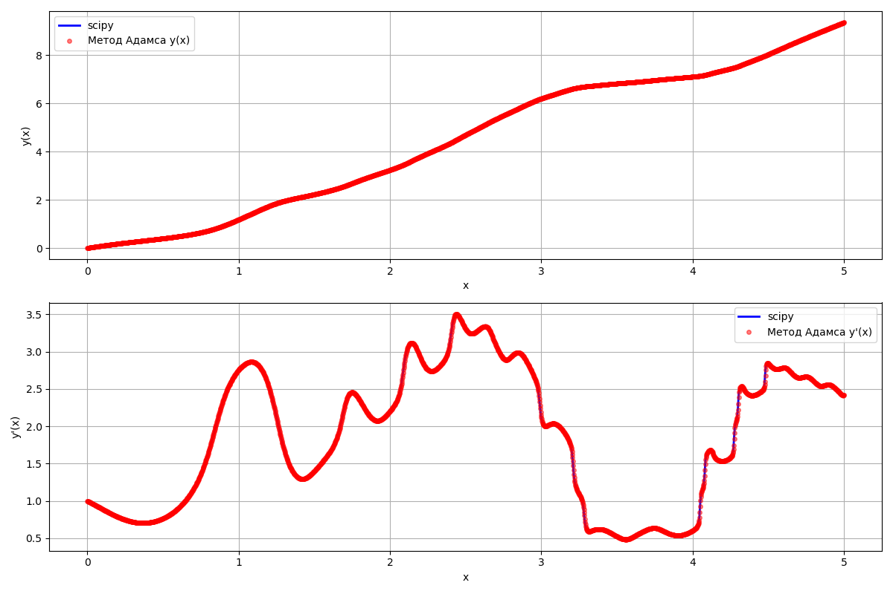
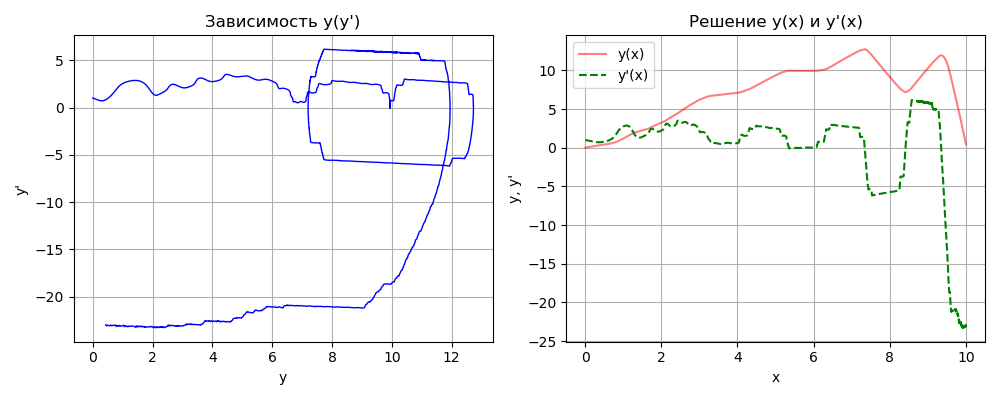
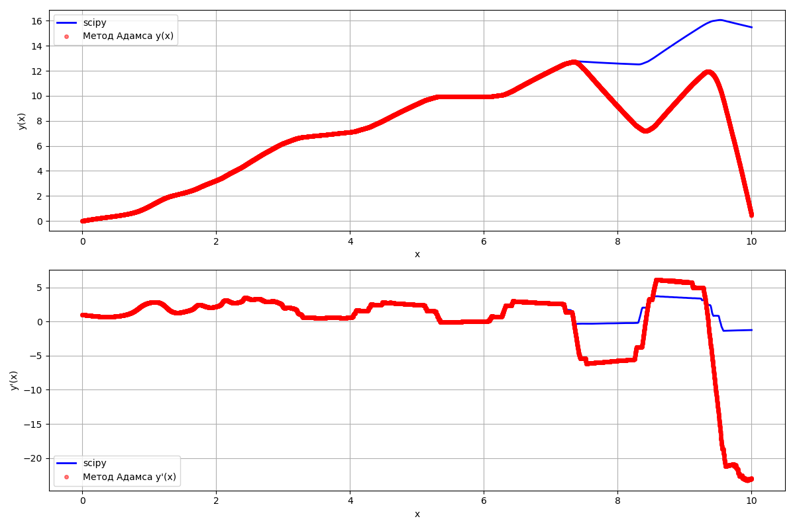

# Отчет по лабораторной работе: Решение дифференциального уравнения методом Адамса-Мултона

Мусин Азат, 2026

---
## Постановка задачи и исходные данные
Изначальное уравнение:
$$ \begin{cases}
y'' + (x^2+1)\sin(3xy) - (x+5)\sin(2xy) = (x^2 - 1)\cos(3x) \\
y(0) = 0 \\
y'(0) = 1
\end{cases} $$

...является дифференциальным уравнением второго порядка, которе будем решать методом Адамса-Мултона.

## Теория
Для метода Адамса-Мултона приводятся следующие формулы:
$$
\begin{aligned}
\Delta f_{i+1} &= f_{i+1} - f_i \\
\Delta^2 f_{i+1} &= f_{i+1} - 2f_i + f_{i-1} \\
\Delta^3 f_{i+1} &= f_{i+1} - 3f_i + 3f_{i-1} - f_{i-2} \\[2mm]
y^{(p)}_{i+1} &= y_i + h\cdot f_{i+1} - \frac{h^2}{2}\cdot\Delta f_{i+1} - \frac{h^3}{12}\cdot\Delta^2 f_{i+1} - \frac{h^4}{24}\cdot\Delta^3 f_{i+1} \\[2mm]
y_{n+1} &= y_n + \frac{h}{24}\bigl(9f^{(p)}_{n+1} + 19f_n - 5f_{n-1} + f_{n-2}\bigr)
\end{aligned}
$$

Однако, для того, чтобы использовать этот метод, необбодимо найти приближённые значения, чтобы потом уточнить их первым методом. Вычислим приближение методом Адамса-**Башфорта**

$$
\begin{aligned}
\Delta f_1 &= f_1 - f_{i-1} \\
\Delta^2 f_1 &= f_1 - 2f_{i-1} + f_{i-2} \\
\Delta^3 f_1 &= f_1 - 3f_{i-1} + 3f_{i-2} + f_{i-3} \\[2mm]
y^{(p)}_{n+1} &= y_n + h\cdot f_i + \frac{h^2}{2}\cdot\Delta f_i + \frac{5h^3}{12}\cdot\Delta^2 f_i + \frac{3h^4}{8}\cdot\Delta^3 f_i \\[2mm]
y^{(p)}_{n+1} &= y_n + \frac{h}{24}\bigl(55f_n - 59f_{n-1} + 37f_{n-2} - 9f_{n-3}\bigr)
\end{aligned}
$$

Однако, для того, чтобы получить начения, необходимо каким-либо образом вычислить первые несколько значений. Для этого, воспользуемся менее точным, но не имеющем такого недостатка методом Рунге-Кутты:

$$
\begin{align*}
k_1 &= f(x, y),\\
k_2 &= f\!\left(x + \frac{h}{2},\; y + \frac{h}{2} k_1\right),\\
k_3 &= f\!\left(x + \frac{h}{2},\; y + \frac{h}{2} k_2\right),\\
k_4 &= f\!\left(x + h,\; y + h k_3\right),\\
\end{align*} $$
$$y_{n+1}= y_n + \frac{h}{6}\bigl(k_1 + 2k_2 + 2k_3 + k_4\bigr)
$$

## Подготовка к вычислению
Для того, чтобы можно было использовать метод необходимо привести уравнение к ОДУ первого порядка. Введём обозначения $y_1(x) = y(x),\space y_2(x) = y'(x).$ Исходное уравнение преобразуется в систему двух уравнений первого порядка:
$$
\begin{cases}
    y'_1 = y_2 \\
    y'_2 = (x^2 - 1)\cos(3x) - (x^2+1)\sin(3xy_2) + (x+5)\sin(2xy_1)
\end{cases}
$$

Иззначально метод Адамса-Млтона предназначен для вычиления уравнений первого порядка. Пример такого ууравнения представлен системой ниже:
$$
\begin{cases}
y'=f(x,y) \\
y (x_0) = y_0
\end{cases}
$$

Для того чтобы вычилить этим методом наш диффур **второго** порядка, представим $y$ в векторной форме:
$$
\begin{align*}
    & y = \begin{pmatrix}
        y_1 \\
        y_2
    \end{pmatrix},
    \\
    & y'(x) = f(x, y(x)),
    \\
    & f(x, y) = \begin{pmatrix}
        y_2 \\
        (x^2 - 1)\cos(3x) - (x^2+1)\sin(3xy_2) + (x+5)\sin(2xy_1)
    \end{pmatrix},
    \\
    & y(0) = \begin{pmatrix}
        1 //
        0
    \end{pmatrix},
\end{align*}
$$

## Вычисления
Для того, чтобы оценить стабильность метода был взят набор отрезков: 
$$
{[0, 1],\space[0, 5],\space[0, 10]}
$$
Так же, для оценки точности аналогичные вычисления были произведены средством математической библиотеки SciPy для Python. По данным построенны графики, чтобы различия можно было сравнить визуально. График зависимости $y(y')$ чтобы оценить быстроту изменения функции.

### Отрезок $[0, 1]$

Подобран оптимальный шаг: $h = 3.33 * 10^{-2}$

| $x$    | $y$      | $y'$     |
| ------ | -------- | -------- |
| 0.0000 | 0.000000 | 1.000000 |
| 0.1000 | 0.094654 | 0.891160 |
| 0.2000 | 0.178431 | 0.788086 |
| 0.3000 | 0.253468 | 0.720580 |
| 0.4000 | 0.324422 | 0.709043 |
| 0.5000 | 0.397545 | 0.765532 |
| 0.6000 | 0.480162 | 0.901736 |
| 0.7000 | 0.581687 | 1.154840 |
| 0.8000 | 0.719140 | 1.650323 |
| 0.9000 | 0.920399 | 2.362026 |
| 1.0000 | 1.179207 | 2.754885 |

Решение в последней точке используя LSODA из scipy
$$x = 1.00,\\
y = 1.179798,\\
y' = 2.757297$$

### Отрезок $[0, 5]$

Подобран оптимальный шаг: $h = 2.13*10^{-3}$

| $x$    | $y$      | $y'$     |
| ------ | -------- | -------- |
| 0.0000 | 0.000000 | 1.000000 |
| 0.5000 | 0.397547 | 0.765527 |
| 1.0000 | 1.179118 | 2.754143 |
| 1.5000 | 2.225002 | 1.399494 |
| 2.0000 | 3.236910 | 2.201240 |
| 2.5000 | 4.692915 | 3.304988 |
| 3.0000 | 6.199772 | 2.122512 |
| 3.5000 | 6.821801 | 0.524741 |
| 4.0000 | 7.103296 | 0.602856 |
| 4.5000 | 8.032246 | 2.841873 |
| 5.0000 | 9.352249 | 2.416258 |

Решение в последней точке используя LSODA из scipy
$$x = 5.00,\\
y = 9.355546,\\
y' = 2.418051$$

### Отрезок $[0, 10]$

Не удалось подобрать шаг за 100 итераций
Выбран шаг: $h = 1.00*10^{-3}$

| $x$     | $y$       | $y'$       |
| ------- | --------- | ---------- |
| 0.0000  | 0.000000  | 1.000000   |
| 1.0000  | 1.179118  | 2.754143   |
| 2.0000  | 3.236910  | 2.201240   |
| 3.0000  | 6.199772  | 2.122571   |
| 4.0000  | 7.103297  | 0.602857   |
| 5.0000  | 9.352159  | 2.416211   |
| 6.0000  | 9.935461  | 0.033313   |
| 7.0000  | 12.019672 | 2.652237   |
| 8.0000  | 9.149959  | -5.733563  |
| 9.0000  | 10.281483 | 5.801614   |
| 10.0000 | 0.437548  | -22.966643 |

Решение в последней точке используя LSODA из scipy
$$x = 10.00,\\
y = 15.480643,\\
y' = -1.246571$$

## Вывод
Как видно, алгоритм неплохо справвляется с поиском решений дифференциальных уравнений. Однако, при большом интервале могут быть проблемы с поиском оптимального шага, а следовательно и с точностью найденных решений. Так же, из-за способа подбора шага вся программа работает довольно медленно, хотя сам алгоритм работает быстро.

## Листинг кода
Листинг кода можно найти в моём GitHub репозитории:
https://github.com/oSTEVEo/mmm/tree/main/mmm6